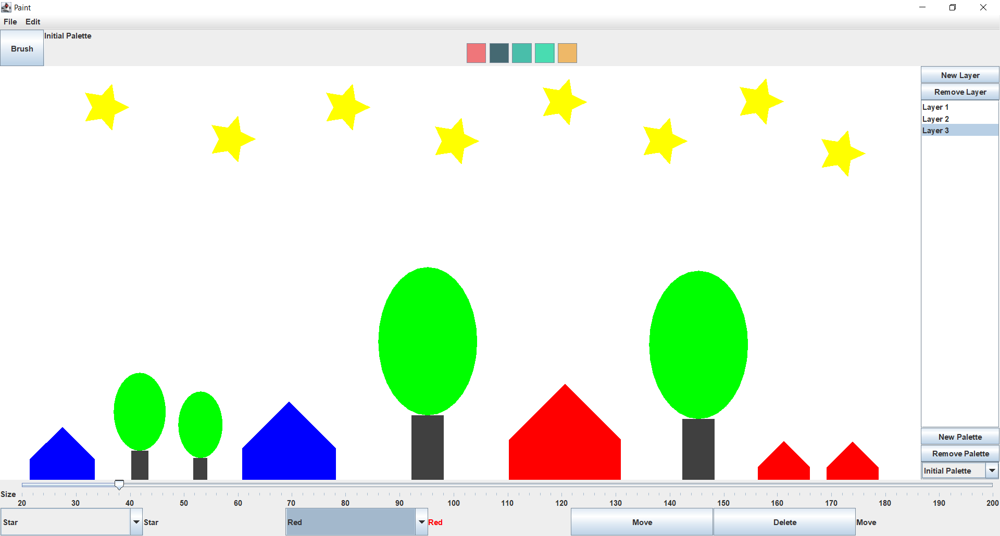

# Java Paint Application

## Introduction
Welcome to the Java Paint Application, a digital painting tool developed using Java Swing and AWT. This application is a culmination of the key concepts and skills acquired from an Object-Oriented Programming course, encompassing Java fundamentals, Swing, and essential design patterns. The project is a testament to practical application of theoretical knowledge in software development.

## Features
- **Brush Tool:** Advanced brush tool for intricate freehand drawing.
- **Shape Drawing:** Capability to draw various geometric shapes, accessible via a combo box.
- **Quick Access Color Selection:** Efficient color selection from a predefined palette.
- **Move and Delete:** Functionalities to precisely move and delete shapes.
- **Undo/Redo:** Implemented using the Command Design Pattern for robust error correction. Accessible via menu or shortcuts (Ctrl+Z for undo, Ctrl+Y for redo).
- **Save/Load Image:** Features to save and load artwork, enhancing usability (shortcuts: Ctrl+S to save, Ctrl+O to load).
- **Multiple Layers:** Support for multiple layers, facilitating complex designs. Layers can be managed through buttons or shortcuts (Ctrl+N to create, Ctrl+D to delete).
- **Custom Color Palette:** Option to create a personalized color palette for unique artistic expression.
- **Resizable Brush and Shapes:** Tools for adjusting brush or shape sizes using a JSlider, with an additional feature to change sizes via Ctrl+Scroll.

## Academic Foundation
This application is inspired by a comprehensive Object-Oriented Programming course, which covered a wide array of topics including Java basics, data structures, control structures, and advanced concepts in object-oriented programming. The course was instrumental in developing a solid foundation in software engineering principles.

## Design Patterns
- **Command Design Pattern:** This pattern is exemplified in the undo and redo functionalities, demonstrating an effective use of design patterns in practical software development.

## Getting Started
To run this application, ensure Java and Java Swing are installed. Clone the repository, navigate to the source directory, and execute the main Java file.

## Contribution
Contributions are welcome. Please feel free to fork this repository and submit pull requests. For significant changes, kindly open an issue first to discuss what you would like to change.
